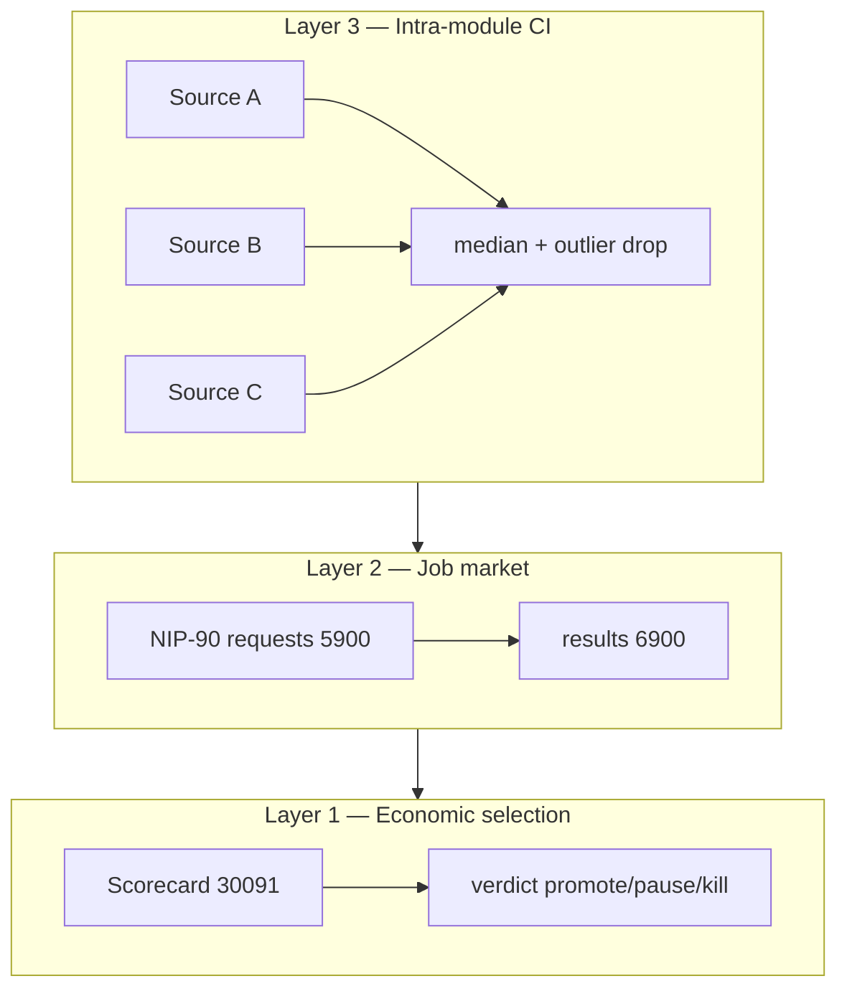

# Collective Intelligence — NostrHiveMind

**Связанные документы:** [README](../README.md) · [economics.md](economics.md) · [nostr-protocol.md](nostr-protocol.md) · [roadmap.md](roadmap.md) · [modules/oracle-feed/README.md](../modules/oracle-feed/README.md)

NostrHiveMind реализует **коллективный интеллект как эволюционирующий рынок специализированных TEE-агентов**, а не как единую монолитную модель. Общая память — Nostr; отбор — ROI; специализация — плагинные модули.

---

## Три слоя

| Слой | Механизм | Где в коде / протоколе |
|------|----------|------------------------|
| **1. Selection** | Модули с `ROI ≥ 1` масштабируются; убыточные — pause/kill | Coordinator, [economics.md](economics.md) |
| **2. Market** | Клиенты платят `bid`; модули конкурируют за jobs | NIP-90, registry `30092` |
| **3. Intra-module** | Несколько источников → median, outlier rejection | `modules/oracle-feed` (`aggregateSourcePrices`) |

---

## Layer 1 — сеть как экосистема

**Shared state (Nostr):**

- Heartbeat `30090` — liveness и capacity
- Scorecard `30091` — публичная fitness-функция (ROI)
- Registry `30092` — discoverability (`module_id`, pubkey, network)

Любой участник может подписаться и увидеть, какие модули «выжили». Это **коллективная память о результатах**, без централизованной БД.

**Coordinator** сегодня — единый арбитр scale (не swarm). Ограничение Phase 2–4; Phase 5+ — multi-relay quorum, выбор воркера по scorecard на стороне client.

---

## Layer 2 — рынок задач

NIP-90 превращает сеть в **распределённый dispatch**:

- Цена `bid` — сигнал спроса
- `job_type` — специализация (`oracle`, позже `ai-decide`, …)
- Feedback `7000` (`paid`, `rejected`) — репутация и settlement

**Collective routing (Phase 5+):** несколько модулей с одним `job_type`; client или coordinator выбирает по `roi`, latency из heartbeat, `quality_score`.

---

## Layer 3 — oracle-feed (первая реализация CI)

Модуль [`oracle-feed`](../modules/oracle-feed/) — reference implementation pull-oracle:

1. **Multi-source median** — ≥2 независимых API; значения с отклонением >5% от медианы отбрасываются.
2. **TEE attestation** — подпись `_STD_.signers` + metadata в `nhmind/oracle-result/v1`.
3. **Revenue ledger** — settled jobs → `getMetrics()` → scorecard.

### Cross-module oracle quorum (backlog)

| Этап | Поведение |
|------|-----------|
| Phase 3 | Один deployment `oracle-feed` |
| Phase 5+ | 2+ deployments; client запрашивает N results; **median across modules** |
| Phase 5+ | Outlier module → `feedback: rejected` → `quality_score` ↓ → pause |

Это **коллективная проверка истины** без единого доверенного oracle.

---

## Что это не является (пока)

| Ожидание | Статус |
|----------|--------|
| Federated learning между модулями | ⬜ backlog |
| Единый LLM «hive mind» | ⬜ не цель; модули автономны |
| Децентрализованный coordinator | ⬜ coordinator — один deployment |
| NIP-AC agent swarm | ⬜ если стандартизируется в Nostr |

---

## Moat сети

Коллективный эффект появляется, когда:

1. Накоплена **история scorecard** (репутация модулей).
2. Есть **несколько paying clients** (не только ops treasury).
3. Стандарт **job settlement** (`paid` → result) воспроизводим.

Копировать ROI-формулу легко; скопировать **экосистему модулей с track record** — сложнее.

---

## Следующие шаги (Phase 3)

1. Canary deploy `oracle-feed` + measured `cost_job_acu`.
2. Coordinator: `COORDINATOR_WATCH_MODULES=hello,oracle-feed`.
3. Smoke: client script → `5900` + `7000 paid` → `6900` result.
4. Phase 4: coordinator читает `getMetrics()` / ledger, не stub `revenue_acu: "0"`.
