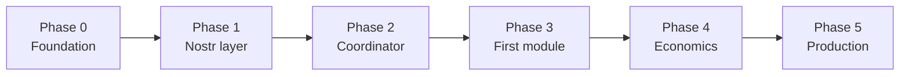

# Roadmap — NostrHiveMind

Живой план развития. Статус обновляется по мере закрытия фаз.

**Связанные документы:** [README](../README.md) (корень) · [map.md](map.md) · [roadmap.md](roadmap.md) · [AGENTS.md](../AGENTS.md) · [github-actions.md](github-actions.md)

---

# NostrHiveMind

Децентрализованная сеть автономных AI-агентов:

- **Исполнение** — Acurast deployments в hardware TEE
- **Координация** — гибрид: Nostr (публичный слой) + Acurast mesh `_STD_.ws` (внутренний горячий путь)
- **Экономика** — ROI-gated autoscaling, treasury ACU/USDC

---

## Текущее состояние — v0.4 (Phase 2 — closing + refactor checkpoint)

| Компонент                                                    | Статус                         |
| ------------------------------------------------------------ | ------------------------------ |
| Архитектура и README                                         | ✅                              |
| Docker-only dev (`scripts/dev`, compose, Dev Container)      | ✅                              |
| Стартовый модуль `modules/hello`                             | ✅                              |
| Scaffold `modules/module-template` + `scripts/new-module.sh` | ✅                              |
| GitHub Actions CI (`verify` + scaffold job)                  | ✅                              |
| GitHub Actions `deploy-canary.yml`                           | ✅ workflow; **deploy-hello smoke ❌** |
| Cursor: `AGENTS.md`, `.cursor/environment.json`, `BUGBOT.md` | ✅                              |
| Roadmap / economics docs                                     | ✅ ([map.md](map.md))           |
| **Активная фаза**                                            | **Phase 2 — Coordinator**      |
| `packages/nostr-client`                                      | ✅ Phase 1                       |
| `modules/coordinator` (код)                                  | ✅                              |
| Relay VM (Selectel) + PTR + A + TLS                          | ✅                              |
| **Deploy Relay** (WSS smoke)                                 | ✅                              |
| `_acu` TXT в Deploy Canary (compute + upsert)                | ✅ GHA + **PTR/TXT verify** ([PR #71](https://github.com/f0ff38/nhmind/pull/71), [#72](https://github.com/f0ff38/nhmind/pull/72)) |
| `hello` on-chain (Deploy Canary)                             | ✅ on-chain; **heartbeat `30090` на relay ❌** |
| `coordinator` canary + registry/scorecard smoke                | ⬜ заблокирован hello heartbeat |
| **Architecture refactor plan**                               | ✅ этот roadmap update; нужен targeted refactor, не rewrite |

---

## Checkpoint — следующая сессия

**Где продолжить:** Phase 2 — **escalate to Acurast** (processor/runtime execution). Relay/DNS и JS/Nostr logic **исключены**: A/B public relay ✅ ([PR #74](https://github.com/f0ff38/nhmind/pull/74), **378424**) + **minimal hello bundle** ✅ ([PR #76](https://github.com/f0ff38/nhmind/pull/76), **378425**) — оба **ack 1/1 pre-window → Expired post-window → sla 0/1**; minimal path (`HELLO_MINIMAL=1`, только `console.log`) **не меняет исход**.

### Симптом (актуально: minimal **378425**, A/B **378424**, production **378423**)

| Шаг Deploy Canary (hello) | Production (`378423`) | A/B damus (`378424`) | Minimal smoke (`378425`, [27469893555](https://github.com/f0ff38/nhmind/actions/runs/27469893555)) |
|---------------------------|---------------------|----------------------|-----------------------------------------------------------------------------------------------------|
| Config | full hello | `RELAY_SKIP_WHITELIST=1` | `HELLO_MINIMAL=1` + damus + skip whitelist |
| Register + pre-window ack | ✅ ack **1/1**, sla **0/1** | ✅ ack **1/1**, sla **0/1** | ✅ ack **1/1**, sla **0/1** |
| Post-window SDK inspect | ❌ **Expired**; ack **0/0** | ❌ **Expired**; ack **0/0** | ❌ **Expired**; ack **0/0** |
| Smoke `30090` | ❌ timeout | ❌ timeout | ⏭ skipped (minimal) |

Ранее: **378421**/**378422** — тот же паттерн. Coordinator deploy **не запускать**.

### Диагностика (следующий шаг)

1. ~~Минимальный hello bundle~~ ✅ **исключено** — [PR #76](https://github.com/f0ff38/nhmind/pull/76), **378425** ([run 27469893555](https://github.com/f0ff38/nhmind/actions/runs/27469893555)): `minimal_smoke=true`, `relay_url_override=wss://relay.damus.io/` — **тот же Expired/sla 0/1** → **не** Nostr/whitelist/network; processor **не выполняет bundle** (или не отчитывается SLA).
2. **Hub Reports** для **378425** (и **378424**/**378423**) — execution logs: bundle стартовал? `hello-minimal-start` vs crash до entry (Hub web — primary; DevTools API **502** из GHA [27470313002](https://github.com/f0ff38/nhmind/actions/runs/27470313002), логи не получены). Post-window inspect **378425** ✅ [27470279264](https://github.com/f0ff38/nhmind/actions/runs/27470279264): **Expired**, ack **0/0**, processor pre-window `5GEr1Nd2XHHddsXjXrXtdQQVT3NnVrUeZB2hFXgpr1n19DBP`. Эскалация: [acurast-escalation-378425.md](acurast-escalation-378425.md).
3. **Acurast support / processor logs** — sla=0/1 при ack 1/1: attestation, `onlyAttestedDevices`, bundle size, Node runtime на processor, `maxAllowedStartDelayInMs`.
4. ~~Изоляция relay~~ ✅ **исключено** — public relay A/B ([PR #74](https://github.com/f0ff38/nhmind/pull/74)).
5. ~~Изоляция JS logic~~ ✅ **исключено** — minimal bundle ([PR #76](https://github.com/f0ff38/nhmind/pull/76)); `minimal_smoke` остаётся за workflow input (не default deploy).

Уже в bundle (main): `hello` `maxNetworkRequests: 10`, `whitelistRelayHost()` (+ opt-out `RELAY_SKIP_WHITELIST` для A/B), canary `onlyAttestedDevices: false`, `maxAllowedStartDelayInMs: 60000` ([PR #72](https://github.com/f0ff38/nhmind/pull/72)). **Minimal path:** `HELLO_MINIMAL=1` / workflow `minimal_smoke` ([github-actions.md](github-actions.md#4-deploy-canary-из-github-actions)).

### После исправления

1. **Deploy Canary** → `hello` — smoke heartbeat ✅.
2. **Deploy Canary** → `coordinator` — preflight + smoke `30092`/`30091`.
3. Обновить deliverables Phase 2 ниже и [relay-ops чеклист](relay-ops.md#чеклист-первого-запуска).

Ops: [relay-ops.md](relay-ops.md#selectel-gitops-провижининг-relay) · GHA: [github-actions.md](github-actions.md#4-deploy-canary-из-github-actions).

---

## Refactor checkpoint — before Phase 3

**Вывод:** архитектура в целом верная: Acurast TEE для исполнения и секретов, Nostr для публичной координации, `_STD_.ws`/P2P только для внутреннего горячего пути. Рефакторинг нужен не потому, что выбран неверный стек, а чтобы убрать протокольные несоответствия перед первым real business module.

### Решения

| Область | Текущее состояние | Изменение |
|---------|-------------------|-----------|
| Processor → relay transport | `httpPOST` посылает Nostr frames прямо на relay URL | Добавить HTTP→WebSocket adapter рядом с relay; `nostr-rs-relay` оставить canonical NIP-01 storage/WS relay |
| NIP-33 терминология | В docs используется NIP-33 | Перейти на формулировку **addressable events: NIP-01, formerly NIP-33**; код/kinds не менять |
| NIP-90 профиль | `5900/6900/7000`, JSON payload, NIP-44 | Зафиксировать как **nhmind DVM-compatible profile**: диапазоны NIP-90 соблюдены, но tags/content intentionally stricter; не обещать full generic DVM compatibility |
| Relay security | WSS smoke есть, write policy минимальная | Включить allowlist kinds/tags/pubkeys после получения deployment pubkeys; добавить negative smoke на rejected event |
| Module contract | `IBusinessModule` описан в README | Вынести shared types/helper package только если Phase 3 реально создаёт второй модуль; до этого не плодить абстракции |
| Economics | ROI уже описан | Не внедрять autoscaling до measured canary cost; Phase 3 должна дать фактический `cost_job_acu` |

### Refactor deliverables

- [x] `infra/nostr-relay`: HTTP→Nostr adapter (Nostr protocol POST body) + docker compose service + nginx route.
- [ ] `packages/nostr-client`: `acurast-http` backend привести к adapter API; обрабатывать `OK`/`EOSE`/ошибки relay, а не считать любой HTTP success публикацией.
- [x] `scripts` / GHA smoke: Acurast-style HTTP POST smoke в **Deploy Relay** (`smoke-relay.sh`).
- [ ] `docs/nostr-protocol.md`: обновить wording NIP-33 → addressable events (NIP-01) и явно описать DVM-compatible profile.
- [ ] `infra/nostr-relay/config.toml` / nginx: kind/tag/pubkey allowlist для canary после фикса pubkeys hello/coordinator.
- [x] `docs/relay-ops.md`: чеклист и описание adapter + HTTP smoke.

### Exit criteria

- `hello` на canary processor публикует `30090`; smoke видит событие через публичный WSS relay.
- `coordinator` на canary processor читает `30090` и публикует `30092`/`30091`.
- Локальный и production пути отличаются только transport backend, не payload schema.
- Документация больше не называет экспериментальный `5900/6900` профиль полным generic NIP-90 без оговорок.

---

## Phase 0 — Foundation

**Цель:** воспроизводимая среда разработки и CI без зависимости от хостового Node.

### Deliverables

- [x] Docker + `scripts/dev` + `.devcontainer`
- [x] `modules/hello` — эталон Acurast-модуля (webpack, vitest, `acurast.json`)
- [x] Mock `_STD_` для локального прогона
- [x] CI: test → bundle → smoke
- [x] Cursor / GitHub integration docs
- [x] Merge foundation PR в `main`
- [x] `modules/module-template` + `scripts/new-module.sh`
- [x] CI matrix (hello + module-template) + scaffold smoke job
- [x] Branch protection на `main` ✅

### Exit criteria

- [x] Любой разработчик с Docker + Cursor клонирует репо и проходит `./scripts/dev test` без ручной настройки Node
- [x] CI зелёный на `main` (после merge)
- [x] Новый модуль создаётся одной командой: `./scripts/new-module.sh <name>`

**Phase 0 — завершена.** Дальше: Phase 1.

---

## Phase 1 — Nostr layer

**Цель:** общая библиотека координации и зафиксированная схема событий.

### Deliverables

- [x] `docs/nostr-protocol.md` — kinds, tags, примеры payload
- [x] `packages/nostr-client` — publish/subscribe, NIP-44, DVM-compatible job helpers
- [x] NIP-01 addressable events (formerly NIP-33) — agent heartbeat (`30090`; scorecard `30091` — Phase 2)
- [x] Интеграционные тесты против `nostr-relay` в compose
- [x] `hello` публикует heartbeat в relay (dev)

### Exit criteria

- [x] Модуль может опубликовать и прочитать своё replaceable-событие через локальный relay
- [x] Схема событий задокументирована и покрыта тестами

**Phase 1 — завершена.** Дальше: Phase 2.

### Риски

- Eventual consistency между relays — заложить last-signed-wins в coordinator (Phase 2)

---

## Phase 2 — Coordinator

**Цель:** deployment на Acurast, который читает Nostr и управляет жизненным циклом модулей.

### Deliverables

- [x] `modules/coordinator` — interval deployment, `@acurast/sdk` (deploy stub in bundle)
- [x] Регистрация модулей (Nostr event → known module list)
- [x] Scorecard aggregator (метрики из module events — stub metrics)
- [x] Verdict engine: `promote` | `pause` | `kill` (правила без on-chain revenue пока — stub metrics)
- [x] Programmatic deploy через SDK (canary) — `deploy-canary.yml` + `scripts/deploy-acurast-sdk.mjs`; autoscale в TEE — Phase 4
- [ ] Canary deploy **coordinator** + smoke registry/scorecard на relay (заблокирован hello heartbeat)
- [ ] Canary deploy **hello** + smoke heartbeat `30090` на relay (on-chain ✅; relay event ❌ — [checkpoint](#checkpoint--следующая-сессия))
- [x] HTTP→Nostr WebSocket adapter для Acurast processor transport (код в `infra/nostr-relay/http-bridge`; deploy на VM — Deploy Relay)
- [x] Acurast-style HTTP smoke в **Deploy Relay** (`smoke-relay.sh` POST `REQ` + `EOSE`)
- [x] **Selectel GitOps (provision)** — `infra/selectel/terraform/` + `provision-relay-infra.yml`; validate ✅, plan ✅, apply ✅
- [x] **Selectel GitOps (deploy relay)** — `infra/nostr-relay/` + `deploy-relay.yml`; WSS smoke ✅
- [x] `_acu` TXT + PTR verify в **Deploy Canary** (jobs `compute-acu-txt`, `ensure-relay-ptr`, `upsert-acu-txt`, `verify-relay-acu-txt`)

### Exit criteria

- Coordinator публикует scorecard в Nostr
- Может зарегистрировать `hello` как модуль и выставить verdict `pause` без human intervention (кроме первого deploy)

### Зависимости

- Phase 1 (nostr-client)
- Funded canary wallet + manual first deploy
- Собственный Nostr relay (`RELAY_URL`) — VPS, поддомен, DNS TXT `_acu.<host>` (см. [nostr-protocol.md](nostr-protocol.md#nostr-relay-на-canary-ops))

### Координация (гибрид)

| Слой | Статус | Заметка |
|------|--------|---------|
| Nostr (NIP-01 addressable events / DVM-compatible jobs) | ✅ код Phase 1–2; docs refactor pending | Exit criteria Phase 2 — на этом слое |
| `_STD_.ws` mesh | ⬜ Phase 3+ | Срочные команды coordinator ↔ module; те же `nhmind/*/v1` схемы |

---

## Phase 3 — First business module

**Цель:** модуль с реальной (пусть небольшой) экономической логикой, прошедший canary-цикл. Начинать только после refactor checkpoint: processor HTTP transport доказан на canary, coordinator читает relay, DVM-compatible profile задокументирован.

### Deliverables

- [x] Выбор experimental-модуля — **`oracle-feed`** (pull-oracle, DVM-compatible jobs); см. [collective-intelligence.md](collective-intelligence.md)
- [x] `modules/oracle-feed/` — `IBusinessModule`, multi-source median, revenue ledger
- [x] `oracle-feed` canary hardening — price API `_STD_.network.whitelist`, `ORACLE_MIN_SOURCES`, requester-only `paid` feedback, skip duplicate `6900`, error results, canonical TEE sign payload ([PR #54](https://github.com/f0ff38/nhmind/pull/54))
- [x] `docs/nostr-protocol.md` — schema `nhmind/oracle-result/v1` (oracle job output)
- [ ] Price proxy на своём домене (`prices.<zone>`) + `_acu` TXT — внешние API напрямую недоступны (см. [oracle-feed README](../modules/oracle-feed/README.md))
- [ ] Canary deploy **`oracle-feed`** + smoke DVM-compatible job (5900 → paid → 6900)
- [ ] Реальные `_STD_.signers` / `httpGET` на canary processor
- [ ] DevTools-enabled deploy, логи проверены
- [ ] 7-дневное canary-окно измерений (ручной или coordinator stub)
- [ ] `_STD_.ws` mesh spike: coordinator → module команды (`pause`/`kill` ack), только после Nostr canary smoke
- [x] `docs/economics.md` — формулы ROI, cost/revenue attribution; модели pull-oracle и AI module ([economics.md](economics.md))

### Exit criteria

- Модуль выполняется на canary processor без mock `_STD_`
- `healthCheck()` и `getMetrics()` возвращают реальные данные
- Документирован фактический ACU cost per execution

### Риски

- DNS TXT whitelist только для своего hostname — price proxy `prices.<zone>` + `_acu` TXT (oracle-feed); relay hostname уже в Deploy Canary; Coinbase/Kraken напрямую недоступны
- `acurast live` + телефон для отладки до canary deploy

---

## Phase 4 — Economics & autoscaling

**Цель:** замкнуть петлю «revenue → ROI → scale».

### Deliverables

- [ ] Treasury tracking (ACU balance, spend per module)
- [ ] ROI расчёт: `(revenue − ACU_cost − relay_fees) / ACU_cost` за окно 7d
- [ ] Coordinator autoscaling: `promote` → `numberOfReplicas↑`, `kill` → cleanup
- [ ] Anti-flapping (hysteresis: promote при ROI ≥ 1.1, pause при ROI < 0.9)
- [x] GitHub workflow `deploy-canary.yml` (`workflow_dispatch`, secrets)
- [ ] Опционально: Deploy Agent (x402) для coordinator без ACU-аккаунта

### Exit criteria

- Хотя бы один модуль прошёл полный цикл: `register → canary → measure → promote | pause`
- Autoscaling срабатывает только при `promote`

### Зависимости

- Phase 2 + Phase 3
- [x] Источник revenue — DVM-compatible job `bid` + feedback settlement → `revenue_acu` ([economics.md § Revenue attribution](economics.md#revenue-attribution))

---

## Phase 5 — Production hardening

**Цель:** mainnet-ready операции без centralized control plane.

### Deliverables

- [ ] `mutability: Immutable` для production-модулей
- [ ] `minProcessorReputation` / `processorWhitelist` для sensitive workloads
- [ ] Mainnet deploy coordinator + validated modules
- [ ] LLM inference module (experimental) — `requiredModules`, confidential inference
- [ ] Path filters в CI для monorepo
- [ ] Публичный relay-лист + fallback strategy
- [ ] Multi-relay read quorum: last-signed-wins по NIP-01 addressable events; write quorum только после стабильного single-relay canary
- [ ] Runbook: incident pause, treasury refill, key rotation (`reuseKeysFrom`)

### Exit criteria

- Coordinator + ≥1 модуль на mainnet с `ROI ≥ 1.0` или осознанный `pause`
- Нет секретов в git; deploy только через secrets / TEE env

---

## Backlog (после Phase 5)

| Идея                           | Заметка                                         |
| ------------------------------ | ----------------------------------------------- |
| GameFi / MEV modules           | High-risk; только после стабильного coordinator |
| NIP-AC / agent swarm           | Если стандартизируется в экосистеме Nostr       |
| Multi-relay quorum             | Снижение зависимости от одного relay            |
| Relay allowlist (kinds/tags/pubkeys) | Из практики Nosflare → `nostr-rs-relay` config + nginx rate limit; см. [relay-ops.md](relay-ops.md) |
| `infra/nostr-relay` + `deploy-relay.yml` | Деплой relay на уже созданную VM (этап 2 GitOps) |
| Multi-pool Selectel / второй relay | Георезерв после стабильного canary |
| `packages/module-template` CLI | `npx create-nhmind-module`                      |
| Cursor Automations             | PR opened → review; CI failed → agent fix       |

---

## Как пользоваться роадмапом

1. **Перед началом фазы** — создать GitHub milestone `Phase N` и issues по deliverables.
2. **При закрытии deliverable** — отметить `[x]` в этом файле (отдельный PR).
3. **Навигация по docs** — [map.md](map.md); корень проекта — [README.md](../README.md).
4. **Агентам (Cursor)** — README → **AGENTS.md** → roadmap → map; задачи из текущей открытой фазы, если не указано иное.
5. **Не перескакивать** Phase 3 (real TEE) без Phase 1–2 — иначе нет координации и схемы событий.

---

## Метрики успеха (сквозные)

| Метрика                      | Целевое значение                        |
| ---------------------------- | --------------------------------------- |
| CI `verify`                  | Зелёный на каждый PR                    |
| Bundle size (hello baseline) | Контроль роста < 500 KB gzip (ориентир) |
| Module ROI                   | ≥ 1.0 для `promote`                     |
| Centralized servers in prod  | 0                                       |
| Secrets in repo              | 0                                       |

