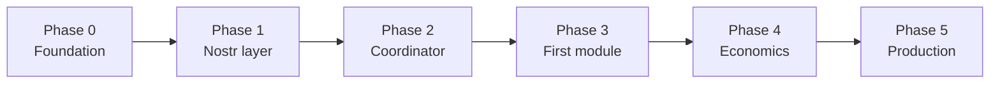

# Roadmap — NostrHiveMind

Живой план развития. Статус обновляется по мере закрытия фаз.

**Связанные документы:** [README](../README.md) · [AGENTS.md](../AGENTS.md) · [github-actions.md](github-actions.md)

---

## North Star

Децентрализованная сеть автономных AI-агентов:

- **Исполнение** — Acurast deployments в hardware TEE
- **Координация** — Nostr (NIP-90 / NIP-44 / NIP-33)
- **Экономика** — ROI-gated autoscaling, treasury ACU/USDC

---

## Текущее состояние — v0.1 (foundation)

| Компонент | Статус |
|-----------|--------|
| Архитектура и README | ✅ |
| Docker-only dev (`scripts/dev`, compose, Dev Container) | ✅ |
| Стартовый модуль `modules/hello` (bundle, mock `_STD_`, tests) | ✅ |
| GitHub Actions CI (`verify`) | ✅ |
| Cursor: `AGENTS.md`, `.cursor/environment.json`, `BUGBOT.md` | ✅ |
| `packages/nostr-client` | ⬜ |
| `modules/coordinator` | ⬜ |
| Canary deploy `hello` на processor | ⬜ |
| Первый revenue-модуль | ⬜ |

---

## Phase 0 — Foundation

**Цель:** воспроизводимая среда разработки и CI без зависимости от хостового Node.

### Deliverables

- [x] Docker + `scripts/dev` + `.devcontainer`
- [x] `modules/hello` — эталон Acurast-модуля (webpack, vitest, `acurast.json`)
- [x] Mock `_STD_` для локального прогона
- [x] CI: test → bundle → smoke
- [x] Cursor / GitHub integration docs
- [ ] Merge PR #1 в `main`, branch protection + required `verify`
- [ ] `modules/module-template` — scaffold для новых модулей (`acurast init` + copy)

### Exit criteria

- Любой разработчик с Docker + Cursor клонирует репо и проходит `./scripts/dev test` без ручной настройки Node
- CI зелёный на `main`

---

## Phase 1 — Nostr layer

**Цель:** общая библиотека координации и зафиксированная схема событий.

### Deliverables

- [ ] `docs/nostr-protocol.md` — kinds, tags, примеры payload
- [ ] `packages/nostr-client` — publish/subscribe, NIP-44 encrypt/decrypt
- [ ] NIP-90 helpers — job request / result / feedback
- [ ] NIP-33 replaceable events — agent heartbeat, module scorecard
- [ ] Интеграционные тесты против `nostr-relay` в compose
- [ ] `hello` публикует heartbeat в relay (dev)

### Exit criteria

- Модуль может опубликовать и прочитать своё replaceable-событие через локальный relay
- Схема событий задокументирована и покрыта тестами

### Риски

- Eventual consistency между relays — заложить last-signed-wins в coordinator (Phase 2)

---

## Phase 2 — Coordinator

**Цель:** deployment на Acurast, который читает Nostr и управляет жизненным циклом модулей.

### Deliverables

- [ ] `modules/coordinator` — interval deployment, `@acurast/sdk`
- [ ] Регистрация модулей (Nostr event → known module list)
- [ ] Scorecard aggregator (метрики из module events)
- [ ] Verdict engine: `promote` | `pause` | `kill` (правила без on-chain revenue пока — stub metrics)
- [ ] Programmatic deploy / scale через SDK (canary only)
- [ ] Canary deploy coordinator + smoke на processor

### Exit criteria

- Coordinator публикует scorecard в Nostr
- Может зарегистрировать `hello` как модуль и выставить verdict `pause` без human intervention (кроме первого deploy)

### Зависимости

- Phase 1 (nostr-client)
- Funded canary wallet + manual first deploy

---

## Phase 3 — First business module

**Цель:** модуль с реальной (пусть небольшой) экономической логикой, прошедший canary-цикл.

### Deliverables

- [ ] Выбор experimental-модуля (oracle, API relay, простой DVM job — не GameFi/MEV на старте)
- [ ] `modules/<name>/` — `IBusinessModule`, production-shaped `acurast.json`
- [ ] Реальные `_STD_.signers` / `httpGET` на canary processor
- [ ] DevTools-enabled deploy, логи проверены
- [ ] 7-дневное canary-окно измерений (ручной или coordinator stub)
- [ ] `docs/economics.md` — формулы ROI, cost attribution

### Exit criteria

- Модуль выполняется на canary processor без mock `_STD_`
- `healthCheck()` и `getMetrics()` возвращают реальные данные
- Документирован фактический ACU cost per execution

### Риски

- DNS TXT whitelist для внешних API — может потребовать отдельный домен
- `acurast live` + телефон для отладки до canary deploy

---

## Phase 4 — Economics & autoscaling

**Цель:** замкнуть петлю «revenue → ROI → scale».

### Deliverables

- [ ] Treasury tracking (ACU balance, spend per module)
- [ ] ROI расчёт: `(revenue − ACU_cost − relay_fees) / ACU_cost` за окно 7d
- [ ] Coordinator autoscaling: `promote` → `numberOfReplicas↑`, `kill` → cleanup
- [ ] Anti-flapping (hysteresis: promote при ROI ≥ 1.1, pause при ROI < 0.9)
- [ ] GitHub workflow `deploy-canary.yml` (`workflow_dispatch`, secrets)
- [ ] Опционально: Deploy Agent (x402) для coordinator без ACU-аккаунта

### Exit criteria

- Хотя бы один модуль прошёл полный цикл: `register → canary → measure → promote | pause`
- Autoscaling срабатывает только при `promote`

### Зависимости

- Phase 2 + Phase 3
- Источник revenue (on-chain или off-chain attribution) — зафиксировать в `economics.md`

---

## Phase 5 — Production hardening

**Цель:** mainnet-ready операции без centralized control plane.

### Deliverables

- [ ] `mutability: Immutable` для production-модулей
- [ ] `minProcessorReputation` / `processorWhitelist` для sensitive workloads
- [ ] Mainnet deploy coordinator + validated modules
- [ ] LLM inference module (experimental) — `requiredModules`, confidential inference
- [ ] Path filters в CI для monorepo
- [ ] Публичный relay-лист + fallback strategy
- [ ] Runbook: incident pause, treasury refill, key rotation (`reuseKeysFrom`)

### Exit criteria

- Coordinator + ≥1 модуль на mainnet с `ROI ≥ 1.0` или осознанный `pause`
- Нет секретов в git; deploy только через secrets / TEE env

---

## Backlog (после Phase 5)

| Идея | Заметка |
|------|---------|
| GameFi / MEV modules | High-risk; только после стабильного coordinator |
| NIP-AC / agent swarm | Если стандартизируется в экосистеме Nostr |
| Multi-relay quorum | Снижение зависимости от одного relay |
| `packages/module-template` CLI | `npx create-nhmind-module` |
| Cursor Automations | PR opened → review; CI failed → agent fix |

---

## Как пользоваться роадмапом

1. **Перед началом фазы** — создать GitHub milestone `Phase N` и issues по deliverables.
2. **При закрытии deliverable** — отметить `[x]` в этом файле (отдельный PR).
3. **Агентам (Cursor)** — брать задачи только из текущей открытой фазы, если не указано иное.
4. **Не перескакивать** Phase 3 (real TEE) без Phase 1–2 — иначе нет координации и схемы событий.

---

## Метрики успеха (сквозные)

| Метрика | Целевое значение |
|---------|------------------|
| CI `verify` | Зелёный на каждый PR |
| Bundle size (hello baseline) | Контроль роста < 500 KB gzip (ориентир) |
| Module ROI | ≥ 1.0 для `promote` |
| Centralized servers in prod | 0 |
| Secrets in repo | 0 |
